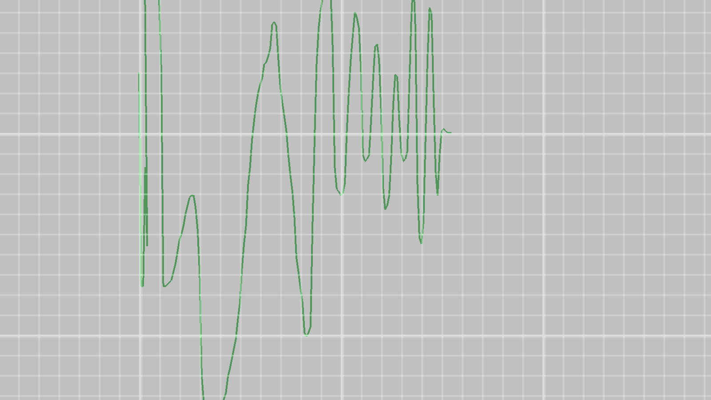

# T C Plotter

Tcp plotter in language c.




# To build and run
```bash
setup_glfw.bat
build_msvc.bat
main.exe
```

# Why

* To live stream data from somewhere to plot it.

# The good

* It's faster than anything else.
* It's easyer to implement client for in any language e.g.:
```csharp
public class TcpPlotter : IDisposable {
  public TcpPlotter() {
    _tcpClient = new TcpClient();
    _writeThread = new Thread(SendingProc);
    _writeThread.Start();
  }
  public void Plot(double d) {
    _q.Enqueue(d);
  }
  public void Dispose() {
    shouldStop = true;
    _tcpClient.Close();
    _tcpClient.Dispose();
    _writeThread.Join();
  }
  private async void SendingProc() {
    while (!shouldStop) {
      try {
        _tcpClient.Connect(new System.Net.IPEndPoint(System.Net.IPAddress.Loopback, 42069));
        while (!shouldStop) {
          if (_q.Count > 0) {
            var val = _q.Dequeue();
            var bytes = System.Text.Encoding.UTF8.GetBytes($"{val} ");
            await _tcpClient.GetStream().WriteAsync(bytes);
          }
          else {
            await Task.Delay(50);
          }
        }
      }
      catch (Exception Ex) {
        await Task.Delay(50);
      }
    }
  }
  private readonly TcpClient _tcpClient;
  private readonly Thread _writeThread;
  private readonly Queue<double> _q = new Queue<double>();
  private bool shouldStop = false;
}
```
* python client most likely shorter.
* You can zoom in and out infinitly ( more or less )
* You can pan by pressing `right mouse button and dragging`
# The bad
* Hardcoded port number ( No need for changing it! )
* Bad documentation
* More or less 0 actions ( no hover over line, no different scales, no menu of any kind, no nothing... )
* Bad arhitecture ( more or less )

# The ugly
* Hardcoded for windows.
* Used msvc specific stuff.
